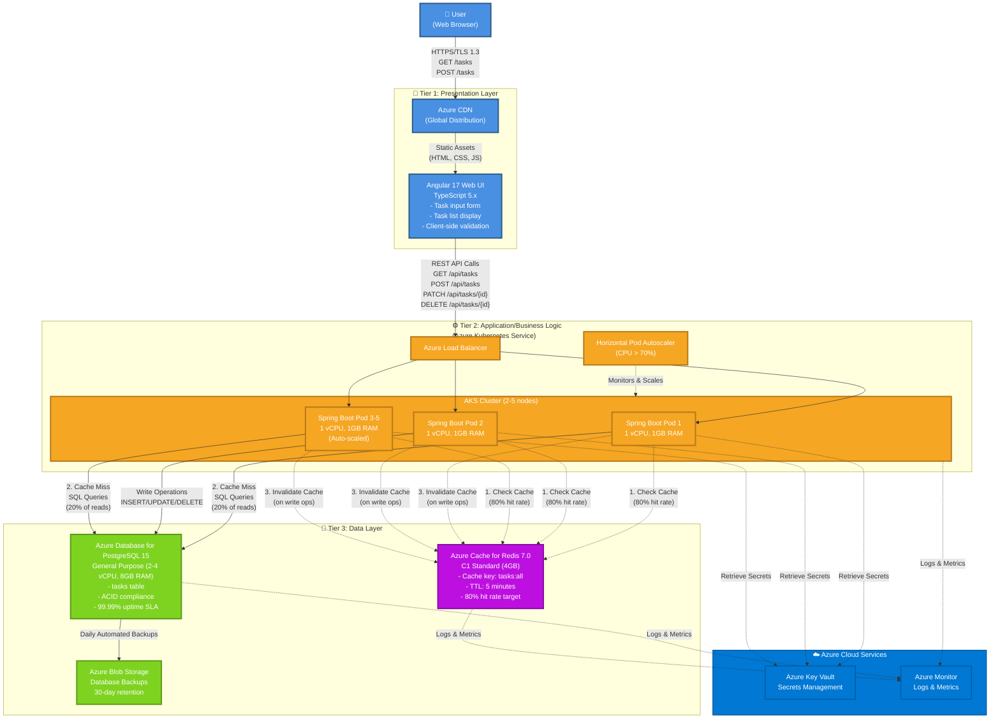

# ARCHITECTURE.md

**System**: 3-Tier To-Do List Application
**Version**: 1.0.0
**Date**: 2025-12-23
**Status**: Draft

## Document Index

**Quick Navigation:**
- [Section 1: Executive Summary](#1-executive-summary) → Lines 15-90
- [Section 2: System Overview](#2-system-overview) → Lines 91-280
- [Section 3: Architecture Principles](#3-architecture-principles) → Lines 281-550
- [Section 4: Architecture Layers](#4-architecture-layers) → Lines 551-850
- [Section 5: Component Details](#5-component-details) → Lines 851-1200
- [Section 6: Data Flow Patterns](#6-data-flow-patterns) → Lines 1201-1350
- [Section 7: Integration Points](#7-integration-points) → Lines 1351-1450
- [Section 8: Technology Stack](#8-technology-stack) → Lines 1451-1600
- [Section 9: Security Architecture](#9-security-architecture) → Lines 1601-1800
- [Section 10: Scalability & Performance](#10-scalability--performance) → Lines 1801-2000
- [Section 11: Operational Considerations](#11-operational-considerations) → Lines 2001-2200
- [Section 12: Architecture Decision Records (ADRs)](#12-architecture-decision-records-adrs) → Lines 2201-end

**Index Last Updated:** 2025-12-23

---

## 1. Executive Summary

### System Purpose

The **3-Tier To-Do List Application** is a cloud-native web application that enables users to manage their daily tasks through a simple, reliable, and persistent task management interface. The system is designed to handle concurrent users with consistent performance while ensuring zero data loss through robust database persistence.

### Key Metrics

**Design Capacity:**
- **Average Read TPS**: 20 transactions/second (task list retrieval, task queries)
- **Average Write TPS**: 10 transactions/second (create, update, delete operations)
- **Measurement Period**: Average expected load in production

**Performance Targets:**
- Add Task: <500ms (p95)
- Display Task List: <1000ms (p95)
- Mark Complete/Delete: <300ms (p95)

**System Availability:**
- Target SLA: 99.9% uptime (8.76 hours/year planned downtime)
- Deployment: Azure Kubernetes Service (AKS)

### Business Value

**Primary Benefits:**
- **Zero Data Loss**: All tasks persisted to database with ACID guarantees
- **Fast Response Times**: Sub-second operations for all core features
- **Scalable Architecture**: Cloud-native design supports growth from 100 to 10,000+ users
- **Simple User Experience**: 4 essential features eliminate complexity

**Target Users:**
- **Productive Professionals** (Primary): Daily task management for work and personal life
- **General Users** (Secondary): Simple task tracking without feature bloat

### Architecture Highlights

**Architecture Type**: 3-Tier Classic Web Application

**Core Technologies:**
- **Presentation Tier**: Angular (web UI)
- **Application Tier**: Spring Boot (REST API + business logic) with Redis cache
- **Data Tier**: PostgreSQL (relational database)
- **Infrastructure**: Azure Kubernetes Service (AKS)

**Key Design Decisions:**
- 3-tier architecture for clear separation of concerns
- Cache layer in Application tier for read performance (20 TPS target)
- RESTful API design for frontend-backend communication
- Stateless Application tier for horizontal scalability

---

## 2. System Overview

### 2.1 Problem Statement

**Current State:**
- Users currently lack a reliable, persistent task management solution for organizing their daily to-do items
- Existing solutions may not meet performance requirements for concurrent users
- Manual task tracking on paper/notes leads to lost tasks and forgotten items
- Users need a cloud-based solution accessible from anywhere

**Pain Points:**
- Tasks get lost when using sticky notes or paper lists
- Complex task management tools have too many features and steep learning curves
- No guarantee of data persistence across browser sessions or device changes
- Inconsistent performance under concurrent user load

**Desired Future State:**
- Users have access to a fast, reliable web-based to-do list application
- All task data is persisted and never lost
- System can scale to handle concurrent users with consistent performance
- Simple interface with only essential features (add, display, complete, delete)

### 2.2 Solution Overview

The **3-Tier To-Do List Application** solves these problems through a cloud-native architecture deployed on Azure AKS with three distinct tiers:

**Tier 1: Presentation Layer**
- Angular-based responsive web UI
- Client-side validation and state management
- RESTful API consumption

**Tier 2: Application/Business Logic Layer**
- Spring Boot REST API services
- Business logic for task CRUD operations
- Redis cache for read performance optimization
- Stateless design for horizontal scalability

**Tier 3: Data Layer**
- PostgreSQL database for persistent task storage
- ACID-compliant transactions for data integrity
- Automated backups for disaster recovery

**Key Differentiators:**
- **Simplicity**: Only 4 essential features, no feature bloat
- **Performance**: Cache-optimized for 20 TPS read operations
- **Reliability**: Zero data loss with database persistence
- **Scalability**: Cloud-native deployment on Azure AKS

### 2.3 Primary Use Cases

#### Use Case 1: Add New Task

**Actors**: User (web application user)

**Description**: User creates a new to-do item by entering text and adding it to their list.

**Primary Flow**:
1. User navigates to the to-do list application
2. User enters task description in text input field (max 500 characters)
3. User clicks "Add" button or presses Enter
4. System validates input (non-empty, sanitized for XSS)
5. System creates new task in database with status = "incomplete"
6. System invalidates cache
7. System returns success response
8. UI refreshes task list display with new task

**Success Metrics:**
- Task creation success rate: >99.5%
- Task creation response time: <500ms (p95)
- Zero data loss incidents

#### Use Case 2: Display All Tasks

**Actors**: User (web application user)

**Description**: User views their complete list of tasks, including both incomplete and completed items.

**Primary Flow**:
1. User navigates to the to-do list application or refreshes page
2. System checks Redis cache for task list
3. If cache hit: Return cached task list (80% of requests)
4. If cache miss: Query PostgreSQL database, populate cache, return results
5. System renders tasks in list format with status indicators

**Success Metrics:**
- List load time: <1000ms (p95)
- Cache hit rate: >80%
- Data accuracy: 100% (list reflects database state)

#### Use Case 3: Mark Task Complete/Incomplete

**Actors**: User (web application user)

**Description**: User toggles task status between "complete" and "incomplete" to track progress.

**Primary Flow**:
1. User views task list with tasks displayed
2. User clicks checkbox next to a task
3. System sends PATCH request to backend API with task ID
4. Backend updates task status in PostgreSQL (toggle)
5. Backend invalidates cache entry
6. Backend returns success response
7. UI updates task display (strikethrough, checkmark icon)

**Success Metrics:**
- Update success rate: >99.5%
- Update response time: <300ms (p95)
- UI responsiveness: Immediate visual feedback (<100ms)

#### Use Case 4: Delete Task

**Actors**: User (web application user)

**Description**: User permanently removes a task from their list.

**Primary Flow**:
1. User views task list
2. User clicks "Delete" button next to a task
3. System displays confirmation dialog (optional - UX decision)
4. User confirms deletion
5. System sends DELETE request to backend API with task ID
6. Backend deletes task from PostgreSQL database (hard delete)
7. Backend invalidates cache
8. Backend returns success response
9. UI removes task from displayed list

**Success Metrics:**
- Delete success rate: >99.5%
- Delete response time: <300ms (p95)
- Zero accidental deletions (if confirmation enabled)

---

## 3. Architecture Principles

This section defines the architectural principles that guide all technical decisions for the 3-Tier To-Do List Application.

### 1. Separation of Concerns

**Description:**
Strictly separate responsibilities across the three architectural tiers to enable independent development, testing, and scaling.

**Implementation:**
- **Presentation Tier (Angular)**: Handles only UI rendering, user input validation, and API communication
- **Application Tier (Spring Boot)**: Implements all business logic, transaction management, and cache orchestration
- **Data Tier (PostgreSQL)**: Manages only data persistence, query execution, and ACID compliance
- **No direct database access from Presentation tier** - all data flows through Application tier APIs

**Trade-offs:**
- **Benefit**: Clear boundaries enable specialized teams, easier testing, and independent scaling
- **Cost**: Additional API layer introduces latency (50-100ms overhead) vs. direct database access
- **Mitigation**: Cache layer in Application tier reduces database round trips for read-heavy operations

### 2. High Availability

**Description:**
Design for 99.9% uptime with automated failover and recovery mechanisms.

**Implementation:**
- **Azure AKS**: Kubernetes-orchestrated container deployment with auto-restart on failure
- **Horizontal scaling**: Run 2+ instances of each tier for redundancy
- **Health checks**: Kubernetes liveness/readiness probes for automatic pod replacement
- **Database replication**: PostgreSQL read replicas for failover (future enhancement)

**Trade-offs:**
- **Benefit**: Minimizes downtime, supports SLA commitments
- **Cost**: 2x infrastructure cost for redundant instances
- **Acceptable**: 99.9% SLA allows 8.76 hours/year planned maintenance

### 3. Scalability First

**Description:**
Design all components to scale horizontally to handle user growth from 100 to 10,000+ users.

**Implementation:**
- **Stateless Application Tier**: Spring Boot services store no session state, enabling unlimited horizontal scaling
- **Redis cache**: Shared cache layer accessible to all Application tier instances
- **Load balancing**: Azure Load Balancer distributes traffic across Presentation and Application tiers
- **Database connection pooling**: HikariCP with tuned pool size (20 connections per instance)

**Trade-offs:**
- **Benefit**: Linear scaling capacity as user base grows
- **Cost**: Stateless design requires external session storage (Redis)
- **Complexity**: Cache invalidation strategy must be carefully managed

### 4. Security by Design

**Description:**
Implement security controls at every tier to protect user data and prevent common web vulnerabilities.

**Implementation:**
- **Input validation**: Client-side (Angular forms) and server-side (Spring Boot validators) validation
- **XSS prevention**: Output encoding in Angular templates, Content Security Policy headers
- **SQL injection prevention**: Use JPA/Hibernate parameterized queries exclusively
- **HTTPS enforcement**: TLS 1.3 for all client-server communication
- **CORS policy**: Restrict cross-origin requests to approved domains

**Trade-offs:**
- **Benefit**: Defense-in-depth protects against OWASP Top 10 vulnerabilities
- **Cost**: Input validation adds 10-20ms processing time per request
- **Acceptable**: Security is prioritized over marginal performance gains

### 5. Observability

**Description:**
Instrument the system for comprehensive monitoring, logging, and troubleshooting.

**Implementation:**
- **Application logs**: Structured JSON logs (Logback) with correlation IDs for request tracing
- **Metrics**: Prometheus metrics for throughput, latency, error rates
- **Health checks**: `/health` and `/ready` endpoints for Kubernetes probes
- **Dashboards**: Grafana dashboards for real-time system health visualization

**Trade-offs:**
- **Benefit**: Rapid issue detection and root cause analysis
- **Cost**: Logging infrastructure adds 5-10% overhead
- **Mitigation**: Use appropriate log levels (INFO for production, DEBUG for development)

### 6. Resilience

**Description:**
Design for graceful degradation when dependencies fail, avoiding cascading failures.

**Implementation:**
- **Fallback mechanisms**: If cache unavailable, Application tier queries database directly
- **Timeouts**: Set aggressive timeouts (5s) on all external calls to prevent thread exhaustion
- **Circuit breaker**: (Future) Implement Resilience4j circuit breakers for database connections
- **Error handling**: Return user-friendly error messages, log detailed errors server-side

**Trade-offs:**
- **Benefit**: System remains partially functional during dependency failures
- **Cost**: Fallback logic increases code complexity
- **Acceptable**: Graceful degradation preferred over complete outage

### 7. Simplicity

**Description:**
Favor simple, well-understood patterns over complex frameworks or premature optimization.

**Implementation:**
- **Monolithic Application Tier**: Single Spring Boot application vs. microservices (appropriate for MVP scale)
- **RESTful APIs**: Standard HTTP verbs (GET, POST, PATCH, DELETE) vs. GraphQL
- **Relational database**: PostgreSQL for structured task data vs. NoSQL
- **Minimal dependencies**: Use Spring Boot starters, avoid unnecessary libraries

**Trade-offs:**
- **Benefit**: Faster development, easier onboarding, lower operational complexity
- **Cost**: May require refactoring to microservices if scale exceeds 100,000+ users
- **Acceptable**: Premature optimization is avoided; refactor when needed

### 8. Cloud-Native

**Description:**
Leverage cloud platform capabilities for deployment, scaling, and operations.

**Implementation:**
- **Azure Kubernetes Service (AKS)**: Container orchestration for auto-scaling and self-healing
- **Azure Database for PostgreSQL**: Managed database service with automated backups
- **Azure Cache for Redis**: Managed cache service with high availability
- **Infrastructure as Code**: Helm charts or Terraform for repeatable deployments

**Trade-offs:**
- **Benefit**: Reduce operational burden, leverage managed services
- **Cost**: Azure costs (~$500-1,000/month estimated) vs. self-hosted infrastructure
- **Acceptable**: Managed services justify cost through reduced DevOps effort

### 9. Open Standards

**Description:**
Use open, vendor-neutral standards to avoid lock-in and ensure interoperability.

**Implementation:**
- **REST over HTTP**: Industry-standard API protocol
- **JSON**: Standard data interchange format
- **PostgreSQL**: Open-source relational database
- **OpenAPI/Swagger**: API documentation standard
- **Docker**: Standard container format compatible with any cloud

**Trade-offs:**
- **Benefit**: Avoid vendor lock-in, easier migration between cloud providers
- **Cost**: May miss Azure-specific optimizations (e.g., Cosmos DB features)
- **Acceptable**: Portability prioritized over vendor-specific features

---

## 4. Architecture Layers

<!-- ARCHITECTURE_TYPE: 3-TIER -->

**Purpose**: Define the three-tier architecture model that separates presentation, business logic, and data concerns.

This architecture follows the **3-Tier Architecture** pattern, designed for standard web applications, REST APIs, and line-of-business systems.

---

## Tiers Overview

| Tier | Function |
|------|----------|
| **Tier 1: Presentation** | User interface layer handling all user interactions, including web pages, API consumption, and client-side logic. |
| **Tier 2: Application/Business Logic** | Core business logic, REST API services, orchestration, business rules, and cache management. |
| **Tier 3: Data** | Data persistence, database management, data access layer, and data integrity enforcement. |

---

## High-Level System Architecture Diagram

This diagram shows the complete 3-tier architecture with all major components and data flows.



**Diagram Description:**

This high-level architecture diagram illustrates the complete 3-tier system with data flows:

- **Tier 1 (Presentation)**: Users interact with Angular 17 web UI served via Azure CDN for global distribution
- **Tier 2 (Application/Business Logic)**: Azure Load Balancer distributes requests across 2-5 Spring Boot pods in AKS cluster. Horizontal Pod Autoscaler monitors CPU usage and scales pods when CPU > 70%
- **Tier 3 (Data)**: Redis cache provides 80% cache hit rate for read operations. PostgreSQL database handles all write operations and cache misses (20% of reads). Daily backups stored in Azure Blob Storage

**Data Flow Patterns:**

1. **Read Flow (Cache Hit - 80%)**: Angular → Load Balancer → Spring Boot Pod → Redis Cache → Response
2. **Read Flow (Cache Miss - 20%)**: Angular → Load Balancer → Spring Boot Pod → PostgreSQL → Populate Cache → Response
3. **Write Flow**: Angular → Load Balancer → Spring Boot Pod → PostgreSQL → Invalidate Cache → Response

**Performance Targets:**
- Read operations: <1000ms (p95)
- Write operations: <500ms (p95)
- Throughput: 20 TPS read, 10 TPS write
- System Availability: 99.9% uptime

---

### Tier 1: Presentation Layer

**Purpose**: Provide a responsive web interface for task management, enabling users to add, view, complete, and delete tasks through an intuitive UI.

**Components**:
- **Web UI**: Angular 17 single-page application (SPA)
- **Client-Side Logic**: TypeScript business logic, form validation, state management
- **HTTP Client**: Angular HttpClient for REST API communication

**Technologies**:
- **Primary**: Angular 17, TypeScript 5.x
- **Supporting**: RxJS (reactive programming), Angular Material (UI components), Angular Forms (validation)

**Key Responsibilities**:
- Render task list with real-time updates
- Client-side input validation (non-empty text, max length 500 characters)
- User input sanitization to prevent XSS attacks
- Manage UI state (loading indicators, error messages)
- Communicate with Application tier via RESTful APIs

**Communication Patterns**:
- **Inbound**: User interactions (clicks, form submissions) from web browsers
- **Outbound**: HTTPS REST API calls to Spring Boot Application tier
- **Protocols**: HTTPS (TLS 1.3), JSON payload format

**Non-Functional Requirements**:
- **Performance**: <2s initial page load, <100ms UI interaction response
- **Availability**: Stateless client, no availability requirements (depends on Application tier)
- **Scalability**: Served via Azure CDN, scales with CDN capacity

---

### Tier 2: Application/Business Logic Layer

**Purpose**: Execute core business logic for task CRUD operations, manage cache for performance, and provide RESTful APIs for Presentation tier.

**Components**:
- **Task REST API**: Spring Boot REST controllers for task operations
- **Task Service**: Business logic for add, display, complete, delete operations
- **Cache Manager**: Redis integration for task list caching (80% cache hit rate target)
- **Validation Service**: Server-side input validation and sanitization

**Technologies**:
- **Primary**: Java 17 (LTS), Spring Boot 3.2
- **Supporting**: Spring Data JPA, Spring Cache (Redis), Hibernate, HikariCP (connection pooling)

**Key Responsibilities**:
- Expose REST API endpoints: GET /tasks, POST /tasks, PATCH /tasks/{id}, DELETE /tasks/{id}
- Execute business logic: validate input, enforce business rules (max length, sanitization)
- Manage Redis cache: cache GET /tasks responses, invalidate cache on POST/PATCH/DELETE
- Transaction management: ACID-compliant database operations via Spring @Transactional
- Error handling: return appropriate HTTP status codes (400, 404, 500) with error details

**Communication Patterns**:
- **Inbound**: HTTPS REST requests from Angular Presentation tier
- **Outbound**: Database queries to PostgreSQL via JPA, Redis cache operations
- **Protocols**: HTTPS (REST), JDBC (PostgreSQL), Redis protocol

**Non-Functional Requirements**:
- **Performance**: <500ms for POST (p95), <1000ms for GET (p95), <300ms for PATCH/DELETE (p95)
- **Throughput**: Support 20 TPS read, 10 TPS write
- **Availability**: 99.9% uptime, run 2+ instances for redundancy
- **Scalability**: Stateless design, horizontal scaling via Kubernetes (target 5 pods under peak load)

---

### Tier 3: Data Layer

**Purpose**: Persist task data with ACID guarantees, ensuring zero data loss and supporting query performance requirements.

**Components**:
- **Database Management System**: PostgreSQL 15 (Azure Database for PostgreSQL)
- **Data Access Layer**: Spring Data JPA repositories with Hibernate ORM
- **Cache Layer**: Azure Cache for Redis (4GB capacity)
- **Connection Pooling**: HikariCP with 20 connections per Application tier instance

**Technologies**:
- **Primary**: PostgreSQL 15 (managed service), Azure Cache for Redis 7.0
- **Supporting**: Hibernate ORM, HikariCP, pg_stat_statements (query monitoring)

**Key Responsibilities**:
- Persist tasks table with columns: id (UUID), description (VARCHAR 500), status (ENUM), created_at, updated_at
- Enforce data integrity via primary keys, NOT NULL constraints
- Execute queries: SELECT all tasks, INSERT task, UPDATE task status, DELETE task
- Automated daily backups to Azure Blob Storage (30-day retention)
- Query performance optimization via indexes on id (PK) and status

**Schema**:
```sql
CREATE TABLE tasks (
    id UUID PRIMARY KEY DEFAULT gen_random_uuid(),
    description VARCHAR(500) NOT NULL,
    status VARCHAR(20) NOT NULL DEFAULT 'incomplete' CHECK (status IN ('incomplete', 'complete')),
    created_at TIMESTAMP NOT NULL DEFAULT CURRENT_TIMESTAMP,
    updated_at TIMESTAMP NOT NULL DEFAULT CURRENT_TIMESTAMP
);

CREATE INDEX idx_tasks_status ON tasks(status);
```

**Communication Patterns**:
- **Inbound**: SQL queries from Application tier via JDBC/JPA
- **Outbound**: Backups to Azure Blob Storage, replication to read replicas (future)
- **Protocols**: PostgreSQL wire protocol (TLS-encrypted), Azure Blob Storage HTTPS

**Non-Functional Requirements**:
- **Performance**: <50ms query response time (p95), support 30 TPS (20 read + 10 write)
- **Availability**: 99.99% uptime (Azure managed service SLA), automated failover
- **Scalability**: Read replicas for horizontal read scaling (future enhancement)
- **Backup**: Daily automated backups, 30-day retention, <1 hour RPO, <2 hour RTO

---

## Data Flow

**Typical Request Flow: Add Task (Write Operation)**

```
1. User enters task description in Angular web UI and clicks "Add"
   ↓
2. Presentation Tier (Angular)
   - Validates input client-side (non-empty, max 500 chars)
   - Sends POST /api/tasks with JSON: {"description": "Buy groceries"}
   ↓
3. Application Tier (Spring Boot)
   - REST controller receives request
   - Validates input server-side (sanitize for XSS, check constraints)
   - Calls TaskService.createTask()
   - TaskService calls TaskRepository.save()
   ↓
4. Data Tier (PostgreSQL)
   - Hibernate executes INSERT INTO tasks (description, status, created_at, updated_at)
   - Database commits transaction, returns generated UUID
   ↓
5. Application Tier (Spring Boot)
   - Cache invalidation: Redis DELETE /tasks cache entry
   - Returns 201 Created with JSON: {"id": "uuid", "description": "Buy groceries", "status": "incomplete"}
   ↓
6. Presentation Tier (Angular)
   - Receives response, updates local state
   - Renders new task in task list without page reload
```

**Typical Request Flow: Display Tasks (Read Operation - Cache Hit)**

```
1. User navigates to application or refreshes page
   ↓
2. Presentation Tier (Angular)
   - Sends GET /api/tasks
   ↓
3. Application Tier (Spring Boot)
   - REST controller receives request
   - Checks Redis cache for key "tasks:all"
   - Cache HIT (80% of requests) → returns cached JSON array
   ↓
4. Presentation Tier (Angular)
   - Receives JSON array: [{"id": "uuid1", ...}, {"id": "uuid2", ...}]
   - Renders task list
```

**Typical Request Flow: Display Tasks (Read Operation - Cache Miss)**

```
1. User navigates to application or refreshes page
   ↓
2. Presentation Tier (Angular)
   - Sends GET /api/tasks
   ↓
3. Application Tier (Spring Boot)
   - REST controller receives request
   - Checks Redis cache for key "tasks:all"
   - Cache MISS (20% of requests)
   ↓
4. Data Tier (PostgreSQL)
   - Hibernate executes SELECT * FROM tasks ORDER BY created_at DESC
   - Database returns result set
   ↓
5. Application Tier (Spring Boot)
   - Populates Redis cache with key "tasks:all", TTL = 5 minutes
   - Returns JSON array to client
   ↓
6. Presentation Tier (Angular)
   - Receives JSON array, renders task list
```

---

## 5. Component Details

<!-- ARCHITECTURE_TYPE: 3-TIER -->

**Purpose**: Deep dive into each component within the three tiers (Presentation, Application/Business Logic, Data), providing detailed technical specifications and operational characteristics.

---

## Tier 1: Presentation Layer - Components

### Angular Task Management Web UI

**Type**: Web UI (Single-Page Application)
**Technology**: Angular 17, TypeScript 5.x
**Version**: 1.0.0
**Location**: `todo-list-ui/` repository

**Purpose**:
Provide a responsive, intuitive web interface for users to manage tasks (add, view, complete, delete) with real-time updates and optimistic UI rendering.

**Responsibilities**:
- Render task list with visual status indicators (checkboxes, strikethrough for completed)
- Handle user input for new task creation (text input, form validation)
- Communicate with Spring Boot REST API for all CRUD operations
- Provide immediate UI feedback (optimistic updates before server confirmation)
- Display error messages for failed operations (network errors, validation failures)

**UI Features**:
- **Task Input Form**: Text input field (max 500 chars) with "Add" button
- **Task List Display**: Scrollable list showing all tasks with status indicators
- **Task Actions**: Checkbox (toggle complete/incomplete), Delete button per task
- **Loading Indicators**: Spinner during API calls
- **Error Messages**: Toast notifications for errors

**Dependencies**:
- **Depends on**: Task REST API (Tier 2, Spring Boot)
- **Depended by**: End users via web browsers (Chrome, Firefox, Safari, Edge)

**Configuration**:
- `API_BASE_URL`: Spring Boot backend URL (e.g., `https://api.todoapp.example.com`)
- `MAX_TASK_LENGTH`: Maximum task description characters (default: 500)
- `REQUEST_TIMEOUT`: HTTP request timeout in ms (default: 5000)

**Scaling**:
- **Horizontal**: Yes, static assets served via Azure CDN (globally distributed)
- **Vertical**: Not applicable (client-side application)

**Failure Modes**:
- **Backend API unavailable**: Display error message "Unable to connect to server. Please try again."
- **Network timeout**: Show retry button, preserve user input
- **Invalid input**: Client-side validation prevents submission, shows inline error

**Monitoring**:
- **Key metrics**: Page load time, API call latency (browser performance API)
- **Alerts**: Not applicable (client-side only)
- **Logs**: Console errors for debugging (dev mode only)

---

## Tier 2: Application/Business Logic Layer - Components

### Task REST API Controller

**Type**: REST API Controller
**Technology**: Spring Boot 3.2, Java 17
**Version**: 1.0.0
**Location**: `src/main/java/com/example/todolist/controller/TaskController.java`

**Purpose**:
Expose RESTful API endpoints for task CRUD operations, handling HTTP requests/responses and delegating business logic to TaskService.

**Responsibilities**:
- Handle incoming HTTP requests (GET, POST, PATCH, DELETE)
- Validate request payloads using Spring Validation annotations
- Map DTOs (Data Transfer Objects) to domain entities
- Format responses as JSON with appropriate HTTP status codes
- Handle exceptions and return error responses (400, 404, 500)

**Endpoints/Routes**:
- `GET /api/tasks`: Retrieve all tasks (returns JSON array)
- `POST /api/tasks`: Create new task (request body: `{"description": "text"}`)
- `PATCH /api/tasks/{id}`: Toggle task status (no request body needed)
- `DELETE /api/tasks/{id}`: Delete task by ID

**Dependencies**:
- **Depends on**: TaskService (Tier 2), Spring Validation
- **Depended by**: Angular UI (Tier 1)

**Configuration**:
- `server.port`: HTTP server port (default: 8080)
- `spring.jackson.date-format`: JSON date format (default: ISO 8601)

**Scaling**:
- **Horizontal**: Yes, stateless controller scales linearly (Kubernetes horizontal pod autoscaler)
- **Vertical**: 1 vCPU, 1GB RAM per pod

**Failure Modes**:
- **TaskService exception**: Return 500 Internal Server Error with error ID for tracking
- **Validation failure**: Return 400 Bad Request with field-level error details
- **Task not found**: Return 404 Not Found

**Monitoring**:
- **Key metrics**: Request rate (req/s), p95 latency, 4xx/5xx error rates
- **Alerts**: Error rate > 1%, p99 latency > 1s
- **Logs**: All requests (HTTP method, path, status, duration), exceptions

---

### Task Service (Business Logic)

**Type**: Application Service
**Technology**: Spring Boot 3.2, Java 17
**Version**: 1.0.0
**Location**: `src/main/java/com/example/todolist/service/TaskService.java`

**Purpose**:
Implement core business logic for task lifecycle management, coordinate cache operations, and enforce business rules.

**Responsibilities**:
- Create new tasks with validation (non-empty, max length 500, XSS sanitization)
- Retrieve all tasks from cache or database (cache-aside pattern)
- Update task status (toggle complete ↔ incomplete)
- Delete tasks and invalidate cache
- Enforce business rules (description required, valid status values)

**Public Methods/API**:
- `getAllTasks(): List<Task>`: Retrieve all tasks (cache-first, fallback to DB)
- `createTask(String description): Task`: Validate and create task, invalidate cache
- `toggleTaskStatus(UUID id): Task`: Toggle status, update DB, invalidate cache
- `deleteTask(UUID id): void`: Delete task, invalidate cache

**Business Rules**:
- Task description must be non-empty (min 1 character)
- Task description max length: 500 characters
- Task status must be "incomplete" or "complete"
- XSS prevention: Sanitize HTML entities in description

**Dependencies**:
- **Depends on**: TaskRepository (Tier 3), CacheManager (Spring Cache + Redis)
- **Depended by**: TaskController (Tier 2)

**Configuration**:
- `spring.cache.redis.time-to-live`: Cache TTL in seconds (default: 300)
- `task.description.max-length`: Max description length (default: 500)

**Scaling**:
- **Horizontal**: Yes, stateless service scales linearly
- **Vertical**: 2 vCPU, 2GB RAM per pod

**Failure Modes**:
- **Database unavailable**: Throw ServiceUnavailableException, return 503
- **Cache unavailable**: Fall back to database query, log warning
- **Invalid input**: Throw ValidationException, return 400

**Monitoring**:
- **Key metrics**: Service call rate, cache hit rate, business rule violations
- **Alerts**: Cache hit rate < 70%, slow DB queries (>100ms)
- **Logs**: All service calls, cache hits/misses, business rule violations, exceptions

---

## Tier 3: Data Layer - Components

### PostgreSQL Task Database

**Type**: Relational Database (Managed Service)
**Technology**: PostgreSQL 15 (Azure Database for PostgreSQL)
**Version**: 15.x
**Location**: Azure-managed instance

**Purpose**:
Persist task data with ACID guarantees, ensuring zero data loss and supporting high-performance queries for 20 TPS read, 10 TPS write.

**Responsibilities**:
- Store tasks table with columns: id, description, status, created_at, updated_at
- Enforce data integrity via primary keys, NOT NULL constraints, CHECK constraints
- Execute queries: SELECT all, INSERT, UPDATE, DELETE
- Automated daily backups to Azure Blob Storage

**Schema**:
```sql
CREATE TABLE tasks (
    id UUID PRIMARY KEY DEFAULT gen_random_uuid(),
    description VARCHAR(500) NOT NULL,
    status VARCHAR(20) NOT NULL DEFAULT 'incomplete' CHECK (status IN ('incomplete', 'complete')),
    created_at TIMESTAMP NOT NULL DEFAULT CURRENT_TIMESTAMP,
    updated_at TIMESTAMP NOT NULL DEFAULT CURRENT_TIMESTAMP
);

CREATE INDEX idx_tasks_status ON tasks(status);
CREATE INDEX idx_tasks_created_at ON tasks(created_at DESC);
```

**Dependencies**:
- **Depends on**: Azure Database for PostgreSQL infrastructure, Azure Blob Storage (backups)
- **Depended by**: TaskRepository (Tier 2)

**Configuration**:
- `DB_HOST`: Database host (Azure-managed endpoint)
- `DB_PORT`: Database port (default: 5432)
- `DB_NAME`: Database name (default: todolist)
- `DB_CONNECTION_POOL_SIZE`: HikariCP max connections (default: 20)

**Scaling**:
- **Horizontal**: Read replicas for read-heavy workloads (future enhancement)
- **Vertical**: 2 vCPU, 8GB RAM (Azure Basic tier)

**Backup & Recovery**:
- **Backup Frequency**: Daily automated backups (Azure managed)
- **Retention Policy**: 30 days
- **Recovery Time Objective (RTO)**: <2 hours
- **Recovery Point Objective (RPO)**: <1 hour (5-minute transaction log backups)

**Failure Modes**:
- **Primary database down**: Azure automatic failover to standby instance (<30s downtime)
- **Connection pool exhausted**: Queue requests, alert on timeout (>5s wait)
- **Slow query**: Log query, alert if p95 > 50ms

**Monitoring**:
- **Key metrics**: Query latency (p50/p95/p99), connection pool usage, disk I/O, storage used
- **Alerts**: Query latency > 50ms, connection pool >80% utilized, storage >80% full
- **Logs**: Slow queries (>20ms), connection errors, transaction rollbacks

---

### Task Repository (Data Access Layer)

**Type**: Data Access Object (DAO) / Repository
**Technology**: Spring Data JPA, Hibernate ORM
**Version**: 1.0.0
**Location**: `src/main/java/com/example/todolist/repository/TaskRepository.java`

**Purpose**:
Provide data access layer for Task entity persistence, abstracting raw SQL queries through JPA repository pattern.

**Responsibilities**:
- CRUD operations for Task entity
- Query optimization via JPA methods
- Transaction management (Spring @Transactional)
- Connection pooling via HikariCP

**Data Access Methods**:
```java
public interface TaskRepository extends JpaRepository<Task, UUID> {
    List<Task> findAll(); // Retrieve all tasks
    Optional<Task> findById(UUID id); // Find by ID
    Task save(Task task); // Insert or update
    void deleteById(UUID id); // Delete by ID
}
```

**Dependencies**:
- **Depends on**: PostgreSQL 15 database
- **Depended by**: TaskService (Tier 2)

**Configuration**:
- `spring.datasource.hikari.maximum-pool-size`: Max connections (default: 20)
- `spring.jpa.hibernate.ddl-auto`: Schema management (default: validate)

**Scaling**:
- **Horizontal**: Not applicable (repository is part of Application tier pods)
- **Vertical**: Depends on Application tier pod resources

**Failure Modes**:
- **Database connection lost**: HikariCP retries, throw exception after 5s timeout
- **Transaction deadlock**: Hibernate retries once, then throws exception

**Monitoring**:
- **Key metrics**: Query execution time, connection acquisition time
- **Alerts**: Query >100ms, connection wait time >500ms
- **Logs**: Slow queries (>20ms), Hibernate SQL statements (debug mode only)

---

### Redis Cache Layer

**Type**: Distributed Cache (Managed Service)
**Technology**: Azure Cache for Redis 7.0
**Version**: 7.0.x
**Location**: Azure-managed instance

**Purpose**:
Provide high-performance in-memory caching for task list queries, achieving 80%+ cache hit rate to reduce database load and improve response times.

**Responsibilities**:
- Cache GET /api/tasks responses (key: "tasks:all", value: JSON array)
- Invalidate cache on write operations (POST, PATCH, DELETE)
- TTL management: Expire cache after 5 minutes to ensure data freshness

**Cache Strategy**:
- **Pattern**: Cache-aside (lazy loading)
- **Read flow**: Check cache → if miss, query DB → populate cache → return data
- **Write flow**: Update DB → invalidate cache → next read repopulates cache

**Dependencies**:
- **Depends on**: Azure Cache for Redis infrastructure
- **Depended by**: TaskService (Tier 2)

**Configuration**:
- `spring.cache.type`: redis
- `spring.data.redis.host`: Azure Redis endpoint
- `spring.data.redis.port`: 6379 (SSL), 6380 (non-SSL)
- `spring.cache.redis.time-to-live`: 300 seconds (5 minutes)

**Scaling**:
- **Horizontal**: Not applicable (single Azure Redis instance)
- **Vertical**: 4GB capacity (C1 Standard tier)

**Failure Modes**:
- **Redis unavailable**: Application falls back to database queries, logs warning
- **Cache eviction**: LRU (Least Recently Used) policy when memory limit reached

**Monitoring**:
- **Key metrics**: Cache hit rate, memory usage, operations per second
- **Alerts**: Cache hit rate < 70%, memory usage > 80%
- **Logs**: Cache connection errors, eviction events

---

## 6. Data Flow Patterns

This section describes how data flows through the system for each core use case.

### Data Flow 1: Create Task (Write Operation)

**Flow Description**: User creates a new task, which is persisted to the database and cache is invalidated.

```
User (Angular) → POST /api/tasks {"description": "Buy milk"}
  ↓
TaskController (Spring Boot)
  - Validates JSON payload (non-null description, max 500 chars)
  - Calls TaskService.createTask("Buy milk")
  ↓
TaskService (Spring Boot)
  - Sanitizes input (HTML entity encoding)
  - Creates Task entity (status = "incomplete", timestamps = now)
  - Calls TaskRepository.save(task)
  ↓
TaskRepository (Spring Data JPA)
  - Executes Hibernate: INSERT INTO tasks (id, description, status, created_at, updated_at) VALUES (...)
  - Commits transaction
  ↓
PostgreSQL Database
  - Persists record, returns generated UUID
  ↓
TaskService (Spring Boot)
  - Cache invalidation: cacheManager.evict("tasks:all")
  - Returns Task entity
  ↓
TaskController (Spring Boot)
  - Maps Task entity to TaskDTO
  - Returns 201 Created with JSON response: {"id": "uuid", "description": "Buy milk", "status": "incomplete"}
  ↓
Angular UI
  - Updates local task list state (optimistic update)
  - Renders new task in list
```

**Performance**: Target <500ms (p95) end-to-end

---

### Data Flow 2: Retrieve Tasks (Read Operation - Cache Hit)

**Flow Description**: User loads the task list, cache hit returns data without database query (80% of requests).

```
User (Angular) → GET /api/tasks
  ↓
TaskController (Spring Boot)
  - Calls TaskService.getAllTasks()
  ↓
TaskService (Spring Boot)
  - Check cache: cacheManager.get("tasks:all")
  - Cache HIT → returns cached List<Task>
  ↓
TaskController (Spring Boot)
  - Maps List<Task> to List<TaskDTO>
  - Returns 200 OK with JSON array: [{"id": "uuid1", ...}, {"id": "uuid2", ...}]
  ↓
Angular UI
  - Renders task list
```

**Performance**: Target <200ms (p95) with cache hit

---

### Data Flow 3: Retrieve Tasks (Read Operation - Cache Miss)

**Flow Description**: User loads the task list, cache miss triggers database query (20% of requests).

```
User (Angular) → GET /api/tasks
  ↓
TaskController (Spring Boot)
  - Calls TaskService.getAllTasks()
  ↓
TaskService (Spring Boot)
  - Check cache: cacheManager.get("tasks:all")
  - Cache MISS → calls TaskRepository.findAll()
  ↓
TaskRepository (Spring Data JPA)
  - Executes Hibernate: SELECT * FROM tasks ORDER BY created_at DESC
  ↓
PostgreSQL Database
  - Returns result set (all task rows)
  ↓
TaskService (Spring Boot)
  - Populate cache: cacheManager.put("tasks:all", tasks) with 5-minute TTL
  - Returns List<Task>
  ↓
TaskController (Spring Boot)
  - Maps List<Task> to List<TaskDTO>
  - Returns 200 OK with JSON array
  ↓
Angular UI
  - Renders task list
```

**Performance**: Target <1000ms (p95) with cache miss

---

### Data Flow 4: Update Task Status (Write Operation)

**Flow Description**: User toggles task status (incomplete ↔ complete), database updated, cache invalidated.

```
User (Angular) → PATCH /api/tasks/{id}
  ↓
TaskController (Spring Boot)
  - Validates UUID path parameter
  - Calls TaskService.toggleTaskStatus(id)
  ↓
TaskService (Spring Boot)
  - Calls TaskRepository.findById(id)
  - If not found, throws TaskNotFoundException
  - Toggles status: status = (status == "incomplete") ? "complete" : "incomplete"
  - Updates updated_at timestamp
  - Calls TaskRepository.save(task)
  ↓
TaskRepository (Spring Data JPA)
  - Executes Hibernate: UPDATE tasks SET status = ?, updated_at = ? WHERE id = ?
  - Commits transaction
  ↓
PostgreSQL Database
  - Updates record
  ↓
TaskService (Spring Boot)
  - Cache invalidation: cacheManager.evict("tasks:all")
  - Returns updated Task entity
  ↓
TaskController (Spring Boot)
  - Returns 200 OK with updated TaskDTO
  ↓
Angular UI
  - Updates task display (strikethrough, checkmark icon)
```

**Performance**: Target <300ms (p95)

---

### Data Flow 5: Delete Task (Write Operation)

**Flow Description**: User deletes a task, record removed from database, cache invalidated.

```
User (Angular) → DELETE /api/tasks/{id}
  ↓
TaskController (Spring Boot)
  - Validates UUID path parameter
  - Calls TaskService.deleteTask(id)
  ↓
TaskService (Spring Boot)
  - Calls TaskRepository.deleteById(id)
  ↓
TaskRepository (Spring Data JPA)
  - Executes Hibernate: DELETE FROM tasks WHERE id = ?
  - Commits transaction
  ↓
PostgreSQL Database
  - Deletes record (hard delete, no soft delete)
  ↓
TaskService (Spring Boot)
  - Cache invalidation: cacheManager.evict("tasks:all")
  - Returns void
  ↓
TaskController (Spring Boot)
  - Returns 204 No Content
  ↓
Angular UI
  - Removes task from displayed list
```

**Performance**: Target <300ms (p95)

---

## 7. Integration Points

This section documents external systems, APIs, and services that the To-Do List application integrates with.

### 7.1 Azure Kubernetes Service (AKS)

**Type**: Infrastructure / Container Orchestration
**Direction**: Application hosted on AKS
**Protocol**: Kubernetes API (kubectl, Helm)

**Purpose**:
Deploy and orchestrate containerized Application tier (Spring Boot) and Presentation tier (Angular) with auto-scaling and self-healing capabilities.

**Integration Details**:
- **Deployment**: Docker containers deployed via Kubernetes Deployment manifests
- **Scaling**: Horizontal Pod Autoscaler (HPA) based on CPU utilization (target 70%)
- **Service Exposure**: Kubernetes LoadBalancer service for external access
- **Health Checks**: Liveness probe (`/actuator/health`), Readiness probe (`/actuator/health/readiness`)

**Configuration**:
- `replicas`: Minimum 2 pods for Application tier
- `resources.requests`: 1 vCPU, 1GB RAM per pod
- `resources.limits`: 2 vCPU, 2GB RAM per pod

**Error Handling**:
- Pod failure: Kubernetes auto-restarts failed pods
- Node failure: Kubernetes reschedules pods to healthy nodes

**Monitoring**:
- **Metrics**: Pod CPU/memory usage, pod restart count, deployment status
- **Alerts**: Pod crash loop (>3 restarts in 10 minutes)

---

### 7.2 Azure Database for PostgreSQL

**Type**: Managed Database Service
**Direction**: Application tier connects to database
**Protocol**: PostgreSQL wire protocol (TLS-encrypted)

**Purpose**:
Provide managed PostgreSQL database with automated backups, high availability, and monitoring.

**Integration Details**:
- **Connection**: JDBC URL via Spring Boot datasource configuration
- **Authentication**: Username/password (Azure Key Vault for secret management)
- **Connection Pooling**: HikariCP with max 20 connections per Application tier pod
- **TLS**: Enforce TLS 1.2+ for all connections

**Configuration**:
```yaml
spring:
  datasource:
    url: jdbc:postgresql://<server>.postgres.database.azure.com:5432/todolist
    username: ${DB_USERNAME}
    password: ${DB_PASSWORD}
    hikari:
      maximum-pool-size: 20
      connection-timeout: 5000
```

**Error Handling**:
- Connection failure: Retry 3 times with exponential backoff, then return 503
- Slow query: Log warning if query >50ms, alert if p95 >100ms

**Monitoring**:
- **Metrics**: Connection count, query latency, transaction throughput
- **Alerts**: Connection pool >80% utilized, query latency >100ms (p95)

---

### 7.3 Azure Cache for Redis

**Type**: Managed Cache Service
**Direction**: Application tier connects to Redis
**Protocol**: Redis protocol (TLS-encrypted)

**Purpose**:
Provide distributed in-memory cache for task list queries, improving read performance and reducing database load.

**Integration Details**:
- **Connection**: Spring Data Redis with Lettuce client
- **Authentication**: Redis access key (Azure Key Vault for secret management)
- **Cache Strategy**: Cache-aside pattern with 5-minute TTL
- **TLS**: Enforce TLS for all connections

**Configuration**:
```yaml
spring:
  cache:
    type: redis
  data:
    redis:
      host: <cache-name>.redis.cache.windows.net
      port: 6380
      ssl: true
      password: ${REDIS_PASSWORD}
      timeout: 2000ms
```

**Error Handling**:
- Cache unavailable: Fall back to database queries, log warning
- Cache timeout: Timeout after 2s, fall back to database

**Monitoring**:
- **Metrics**: Cache hit rate, memory usage, operations per second
- **Alerts**: Cache hit rate <70%, memory usage >80%

---

### 7.4 Azure Blob Storage (Backups)

**Type**: Object Storage
**Direction**: PostgreSQL automated backups
**Protocol**: HTTPS (Azure Storage API)

**Purpose**:
Store daily PostgreSQL database backups for disaster recovery.

**Integration Details**:
- **Backup Schedule**: Daily full backup at 2:00 AM UTC
- **Retention**: 30 days
- **Access**: Azure Database for PostgreSQL automated backup feature

**Monitoring**:
- **Metrics**: Backup success rate, backup size, storage used
- **Alerts**: Backup failure, storage >80% capacity

---

### 7.5 External Integrations (Future)

**Note**: The MVP does not include external integrations. Future enhancements may include:

- **Email Service** (SendGrid, AWS SES): Send task reminders
- **Authentication Provider** (Azure AD, Auth0): User authentication
- **Analytics** (Google Analytics, Mixpanel): Usage tracking

---

## 8. Technology Stack

This section documents all technologies, frameworks, libraries, and tools used in the system.

### Frontend Technologies

| Technology | Version | Purpose | Justification |
|------------|---------|---------|---------------|
| **Angular** | 17.x | Web UI framework | Industry-standard SPA framework, TypeScript support, reactive programming (RxJS) |
| **TypeScript** | 5.x | Programming language | Type safety, better IDE support, catches errors at compile-time |
| **RxJS** | 7.x | Reactive programming | Handle async operations (HTTP calls), event streams |
| **Angular Material** | 17.x | UI component library | Pre-built Material Design components (buttons, forms, lists) |
| **Angular Forms** | 17.x | Form validation | Client-side validation, reactive forms |

### Backend Technologies

| Technology | Version | Purpose | Justification |
|------------|---------|---------|---------------|
| **Java** | 17 (LTS) | Programming language | Long-term support, mature ecosystem, Spring Boot compatibility |
| **Spring Boot** | 3.2.x | Application framework | Rapid development, auto-configuration, production-ready features |
| **Spring Web** | 3.2.x | REST API framework | RESTful web services, JSON serialization, exception handling |
| **Spring Data JPA** | 3.2.x | Data access layer | ORM abstraction, repository pattern, query methods |
| **Hibernate** | 6.x | ORM framework | Object-relational mapping, HQL queries, lazy loading |
| **Spring Cache** | 3.2.x | Caching abstraction | Cache-aside pattern, Redis integration |
| **Spring Validation** | 3.2.x | Input validation | Bean validation annotations (@NotNull, @Size) |
| **HikariCP** | 5.x | Connection pooling | Fast, lightweight JDBC connection pool |
| **Logback** | 1.4.x | Logging framework | Structured JSON logging, log levels, log rotation |

### Data Tier Technologies

| Technology | Version | Purpose | Justification |
|------------|---------|---------|---------------|
| **PostgreSQL** | 15.x | Relational database | ACID compliance, JSON support, mature ecosystem |
| **Azure Database for PostgreSQL** | Managed service | Managed PostgreSQL | Automated backups, high availability, monitoring |
| **Redis** | 7.0.x | Distributed cache | In-memory cache, sub-millisecond latency, TTL support |
| **Azure Cache for Redis** | Managed service | Managed Redis | High availability, scaling, monitoring |

### Infrastructure & DevOps

| Technology | Version | Purpose | Justification |
|------------|---------|---------|---------------|
| **Docker** | 24.x | Containerization | Package application with dependencies, portable across environments |
| **Kubernetes** | 1.28.x | Container orchestration | Auto-scaling, self-healing, rolling updates |
| **Azure Kubernetes Service (AKS)** | Managed service | Managed Kubernetes | Azure-managed control plane, integration with Azure services |
| **Helm** | 3.x | Kubernetes package manager | Templated deployments, versioning, rollback |
| **Azure Key Vault** | Managed service | Secret management | Secure storage for passwords, API keys, certificates |
| **Prometheus** | 2.x | Metrics collection | Time-series metrics, PromQL queries |
| **Grafana** | 10.x | Metrics visualization | Dashboards, alerting, multi-source data |

### Build & Development Tools

| Technology | Version | Purpose | Justification |
|------------|---------|---------|---------------|
| **Maven** | 3.9.x | Java build tool | Dependency management, build lifecycle, plugin ecosystem |
| **npm** | 10.x | Node package manager | Frontend dependency management |
| **Angular CLI** | 17.x | Angular tooling | Code generation, dev server, build optimization |
| **JUnit 5** | 5.x | Unit testing (Java) | Assertions, test lifecycle, parameterized tests |
| **Mockito** | 5.x | Mocking framework | Mock dependencies, verify interactions |
| **Jasmine** | 5.x | Unit testing (Angular) | BDD-style tests, assertions |
| **Karma** | 6.x | Test runner (Angular) | Run tests in browsers, code coverage |

### Monitoring & Observability

| Technology | Version | Purpose | Justification |
|------------|---------|---------|---------------|
| **Spring Boot Actuator** | 3.2.x | Application monitoring | Health checks, metrics endpoints (/actuator/health, /actuator/metrics) |
| **Micrometer** | 1.12.x | Metrics instrumentation | Export metrics to Prometheus, custom metrics |
| **Azure Monitor** | Managed service | Application monitoring | Log analytics, performance monitoring, alerts |

---

## 9. Security Architecture

This section documents security controls, authentication, authorization, and compliance measures.

### 9.1 Authentication & Authorization

**Current State (MVP)**: No authentication required (single-user global task list)

**Future State (Phase 2+)**:
- **Authentication**: OAuth 2.0 with JWT tokens
- **Identity Provider**: Azure AD or Auth0
- **Authorization**: Role-Based Access Control (RBAC) with roles: User, Admin
- **Session Management**: Stateless JWT tokens with 24-hour expiration

**Justification for MVP**:
- Simplicity: Avoid authentication complexity for initial release
- Single-user assumption: All users see the same global task list (per Product Owner Spec)
- Trade-off: Security risk mitigated by deployment to internal network or VPN-only access

---

### 9.2 Input Validation & Sanitization

**Client-Side Validation (Angular)**:
- **Non-empty description**: Angular Forms required validator
- **Max length**: 500 characters (maxLength validator)
- **Real-time feedback**: Show inline error messages on blur/submit

**Server-Side Validation (Spring Boot)**:
- **Bean Validation**: `@NotNull @Size(min=1, max=500)` on Task entity
- **XSS Prevention**: HTML entity encoding using OWASP Java HTML Sanitizer
- **SQL Injection Prevention**: JPA parameterized queries (no raw SQL)

**Example**:
```java
@Entity
public class Task {
    @NotNull(message = "Description cannot be null")
    @Size(min = 1, max = 500, message = "Description must be 1-500 characters")
    private String description;
}
```

---

### 9.3 Data Protection

**Encryption in Transit**:
- **HTTPS**: TLS 1.3 for all client-server communication (Angular ↔ Spring Boot)
- **Database connections**: TLS 1.2+ for PostgreSQL connections
- **Cache connections**: TLS for Redis connections
- **Certificate Management**: Let's Encrypt or Azure-managed certificates

**Encryption at Rest**:
- **Database**: Azure Database for PostgreSQL Transparent Data Encryption (TDE) enabled by default
- **Backups**: Azure Blob Storage encryption enabled by default
- **Cache**: Azure Cache for Redis encryption at rest

**Secret Management**:
- **Azure Key Vault**: Store database passwords, Redis keys, API secrets
- **Environment Variables**: Inject secrets as environment variables in Kubernetes pods
- **No hardcoded secrets**: Enforce via code review and static analysis

---

### 9.4 Network Security

**Firewall Rules**:
- **Azure Network Security Groups (NSG)**: Allow only HTTPS (443) inbound to AKS load balancer
- **Database Firewall**: Allow connections only from AKS subnet
- **Redis Firewall**: Allow connections only from AKS subnet

**CORS Policy**:
- **Allow Origins**: Only approved frontend domains (e.g., `https://todoapp.example.com`)
- **Allowed Methods**: GET, POST, PATCH, DELETE
- **Allowed Headers**: Content-Type, Authorization (future)

**Example** (Spring Boot):
```java
@Configuration
public class WebConfig implements WebMvcConfigurer {
    @Override
    public void addCorsMappings(CorsRegistry registry) {
        registry.addMapping("/api/**")
                .allowedOrigins("https://todoapp.example.com")
                .allowedMethods("GET", "POST", "PATCH", "DELETE");
    }
}
```

---

### 9.5 Security Headers

**HTTP Security Headers** (Spring Security):
- **Content-Security-Policy**: `default-src 'self'`
- **X-Content-Type-Options**: `nosniff`
- **X-Frame-Options**: `DENY`
- **X-XSS-Protection**: `1; mode=block`
- **Strict-Transport-Security**: `max-age=31536000; includeSubDomains`

---

### 9.6 Vulnerability Management

**Dependency Scanning**:
- **OWASP Dependency-Check**: Scan Maven dependencies for known CVEs
- **npm audit**: Scan Angular dependencies for vulnerabilities
- **Frequency**: Weekly automated scans, block builds on HIGH/CRITICAL findings

**Penetration Testing**:
- **Frequency**: Quarterly penetration tests (external vendor)
- **Scope**: OWASP Top 10 testing (XSS, SQLi, CSRF, etc.)

**Patching Policy**:
- **Critical vulnerabilities**: Patch within 7 days
- **High vulnerabilities**: Patch within 30 days
- **Medium/Low vulnerabilities**: Patch in next release cycle

---

## 10. Scalability & Performance

This section documents performance targets, scaling strategies, and capacity planning.

### 10.1 Performance Targets

| Metric | Target | Measurement Method |
|--------|--------|-------------------|
| **Add Task (POST)** | <500ms (p95) | Spring Boot Actuator metrics, Prometheus |
| **Display Tasks (GET - cache hit)** | <200ms (p95) | Spring Boot Actuator metrics |
| **Display Tasks (GET - cache miss)** | <1000ms (p95) | Spring Boot Actuator metrics |
| **Mark Complete (PATCH)** | <300ms (p95) | Spring Boot Actuator metrics |
| **Delete Task (DELETE)** | <300ms (p95) | Spring Boot Actuator metrics |
| **Read Throughput** | 20 TPS sustained | Load testing (JMeter, Gatling) |
| **Write Throughput** | 10 TPS sustained | Load testing (JMeter, Gatling) |
| **Cache Hit Rate** | >80% | Redis metrics, Micrometer |

---

### 10.2 Scaling Strategy

**Horizontal Scaling**:

| Tier | Scaling Approach | Trigger | Max Instances |
|------|-----------------|---------|---------------|
| **Presentation (Angular)** | Azure CDN (global distribution) | N/A (CDN auto-scales) | Unlimited |
| **Application (Spring Boot)** | Kubernetes Horizontal Pod Autoscaler (HPA) | CPU >70% | 10 pods |
| **Database (PostgreSQL)** | Read replicas (future) | Read latency >50ms | 3 replicas |
| **Cache (Redis)** | Azure Cache scaling (future) | Memory >80% | C6 tier (26GB) |

**Vertical Scaling**:

| Tier | Current Resources | Max Resources | Trigger |
|------|------------------|---------------|---------|
| **Application Pod** | 1 vCPU, 1GB RAM | 2 vCPU, 2GB RAM | Memory >80% sustained |
| **Database** | 2 vCPU, 8GB RAM | 8 vCPU, 32GB RAM | CPU >70% or storage >80% |
| **Cache** | 4GB (C1 Standard) | 26GB (C6 Standard) | Memory >80% |

---

### 10.3 Caching Strategy

**Cache Layers**:

1. **Application-Level Cache (Redis)**:
   - **Key**: `tasks:all`
   - **Value**: JSON array of all tasks
   - **TTL**: 5 minutes
   - **Invalidation**: On POST/PATCH/DELETE operations
   - **Hit Rate Target**: >80%

2. **Database Query Cache (PostgreSQL)**:
   - Shared buffers: 2GB (25% of database RAM)
   - Effective cache size: 6GB (75% of database RAM)

**Cache Warming**:
- No pre-warming required (cache-aside pattern, lazy loading)

---

### 10.4 Database Optimization

**Indexes**:
```sql
CREATE INDEX idx_tasks_status ON tasks(status);
CREATE INDEX idx_tasks_created_at ON tasks(created_at DESC);
```

**Connection Pooling**:
- HikariCP: 20 connections per Application tier pod
- Total connections: 20 × (number of pods) = 40 connections (2 pods) to 200 connections (10 pods max)

**Query Optimization**:
- **Avoid N+1 queries**: Use JPA `JOIN FETCH` or `@EntityGraph`
- **Pagination**: Implement pagination for GET /tasks if task count >1000 (future enhancement)

---

### 10.5 Load Testing

**Test Scenarios**:

1. **Read-Heavy Workload** (80% reads, 20% writes):
   - 16 concurrent users performing GET /tasks
   - 4 concurrent users performing POST/PATCH/DELETE
   - Sustained for 5 minutes
   - Expected: All requests <1s (p95), no errors

2. **Write-Heavy Workload** (50% reads, 50% writes):
   - 10 concurrent users performing GET /tasks
   - 10 concurrent users performing POST/PATCH/DELETE
   - Sustained for 5 minutes
   - Expected: All requests <1s (p95), <1% errors

**Load Testing Tools**:
- Apache JMeter or Gatling
- Run tests in Azure staging environment (identical to production)

---

### 10.6 Capacity Planning

**Initial Deployment** (100 users):
- Application tier: 2 pods (1 vCPU, 1GB RAM each)
- Database: 2 vCPU, 8GB RAM (Basic tier)
- Cache: 4GB (C1 Standard)
- **Estimated Cost**: $300-400/month

**Growth to 1,000 users**:
- Application tier: 5 pods (scale out)
- Database: 4 vCPU, 16GB RAM (scale up)
- Cache: 13GB (C3 Standard)
- **Estimated Cost**: $800-1,000/month

**Growth to 10,000 users**:
- Application tier: 10 pods (scale out)
- Database: 8 vCPU, 32GB RAM + 2 read replicas
- Cache: 26GB (C6 Standard)
- **Estimated Cost**: $2,000-3,000/month

---

## 11. Operational Considerations

This section documents deployment, monitoring, logging, and operational procedures.

### 11.1 Deployment

**Deployment Platform**: Azure Kubernetes Service (AKS)

**Deployment Strategy**: Rolling Update
- Update pods one at a time to maintain availability
- MaxUnavailable: 1 pod
- MaxSurge: 1 pod (deploy new pod before terminating old pod)

**Deployment Steps**:
1. Build Docker images (Angular, Spring Boot)
2. Push images to Azure Container Registry (ACR)
3. Update Helm chart with new image tags
4. Deploy to AKS: `helm upgrade todolist ./helm/todolist --namespace production`
5. Verify health checks pass: `kubectl get pods -n production`
6. Monitor metrics for 15 minutes post-deployment

**Rollback Procedure**:
- If deployment fails or errors spike: `helm rollback todolist`
- Kubernetes automatically reverts to previous working version

---

### 11.2 Monitoring

**Metrics Collection**:
- **Spring Boot Actuator**: Expose `/actuator/metrics` endpoint
- **Micrometer**: Export metrics to Prometheus
- **Prometheus**: Scrape metrics every 15 seconds
- **Grafana**: Visualize metrics with dashboards

**Key Metrics**:

| Metric | Description | Alert Threshold |
|--------|-------------|-----------------|
| **http.server.requests** | Request rate, latency, status codes | p95 latency >1s, error rate >1% |
| **cache.gets** | Cache hit/miss rate | Hit rate <70% |
| **hikaricp.connections.active** | Database connection pool usage | >80% utilized |
| **jvm.memory.used** | Application memory usage | >80% of heap |
| **system.cpu.usage** | Pod CPU usage | >80% sustained |

**Dashboards**:
- **Application Performance**: Request rate, latency, error rate
- **Database Performance**: Query latency, connection pool, storage
- **Cache Performance**: Hit rate, memory usage, operations per second
- **Infrastructure**: Pod CPU/memory, node health, deployment status

---

### 11.3 Logging

**Logging Framework**: Logback (Spring Boot default)

**Log Format**: Structured JSON logs for parsing by Azure Monitor

**Log Levels**:
- **INFO** (production): Application startup, API requests (method, path, status, duration), cache hits/misses
- **WARN**: Slow queries (>50ms), cache unavailable (fallback to DB), configuration issues
- **ERROR**: Exceptions, database connection failures, uncaught errors
- **DEBUG** (development only): SQL statements, cache operations, detailed request/response

**Log Storage**:
- **Azure Monitor Logs**: Centralized log aggregation, query via Kusto Query Language (KQL)
- **Retention**: 90 days

**Example Log Entry**:
```json
{
  "timestamp": "2025-12-23T10:30:45.123Z",
  "level": "INFO",
  "logger": "com.example.todolist.controller.TaskController",
  "message": "HTTP request completed",
  "method": "POST",
  "path": "/api/tasks",
  "status": 201,
  "duration_ms": 234,
  "correlation_id": "abc123"
}
```

---

### 11.4 Alerting

**Alerting Platform**: Prometheus Alertmanager + Azure Monitor Alerts

**Alert Channels**:
- **Email**: DevOps team distribution list
- **Slack**: #alerts channel
- **PagerDuty**: Critical alerts only (P1 incidents)

**Alert Rules**:

| Alert | Condition | Severity | Response |
|-------|-----------|----------|----------|
| **High Error Rate** | Error rate >1% for 5 minutes | P2 (High) | Investigate logs, check recent deployments |
| **High Latency** | p95 latency >1s for 10 minutes | P2 (High) | Check database performance, cache hit rate |
| **Pod Crash Loop** | Pod restarts >3 in 10 minutes | P1 (Critical) | Check logs, rollback if recent deployment |
| **Database Unavailable** | PostgreSQL connection failure | P1 (Critical) | Check Azure Database status, contact Azure support |
| **Cache Unavailable** | Redis connection failure | P2 (High) | Verify Redis service, fallback to DB queries |
| **Low Cache Hit Rate** | Cache hit rate <70% for 30 minutes | P3 (Medium) | Investigate cache invalidation logic, increase TTL |

---

### 11.5 Backup & Disaster Recovery

**Database Backups**:
- **Frequency**: Daily automated backups (Azure Database for PostgreSQL)
- **Retention**: 30 days
- **Storage**: Azure Blob Storage (geo-redundant)
- **Testing**: Monthly restore test to validate backup integrity

**Recovery Objectives**:
- **RTO (Recovery Time Objective)**: <2 hours
- **RPO (Recovery Point Objective)**: <1 hour (5-minute transaction log backups)

**Disaster Recovery Procedure**:
1. Identify failure scope (database corruption, data center outage)
2. Restore from latest backup (Azure portal or CLI)
3. Validate data integrity (check task count, sample queries)
4. Update connection strings to point to restored database
5. Redeploy Application tier to reconnect to new database
6. Verify application health checks pass
7. Communicate restoration to users

**Disaster Recovery Testing**:
- **Frequency**: Quarterly DR drills
- **Scope**: Full backup restore to staging environment, validate functionality

---

### 11.6 Incident Response

**Incident Severity Levels**:

| Level | Description | Response Time | Example |
|-------|-------------|---------------|---------|
| **P1 (Critical)** | System down, data loss | <15 minutes | Database unavailable, pod crash loop |
| **P2 (High)** | Degraded performance, partial outage | <1 hour | High error rate, slow queries |
| **P3 (Medium)** | Minor issues, workarounds available | <4 hours | Low cache hit rate, non-critical warnings |
| **P4 (Low)** | Cosmetic issues, feature requests | Next release | UI typos, minor UX improvements |

**Incident Response Process**:
1. **Detection**: Alert triggered (Prometheus, Azure Monitor) or user report
2. **Triage**: Assess severity, assign incident commander
3. **Investigation**: Review logs, metrics, recent changes
4. **Mitigation**: Apply fix (rollback, scale resources, manual intervention)
5. **Verification**: Confirm issue resolved, monitor for 30 minutes
6. **Postmortem**: Document root cause, action items to prevent recurrence

---

## 12. Architecture Decision Records (ADRs)

This section tracks key architectural decisions made for the To-Do List application.

**Purpose**: Document the "why" behind technical choices to provide context for future team members and explain trade-offs.

**Format**: Each ADR follows the template defined in [ADR_GUIDE.md](adr/ADR_GUIDE.md)

**ADR Location**: All ADRs are stored in the `/adr` directory.

---

### ADR Summary Table

| ADR | Title | Status | Date | Impact |
|-----|-------|--------|------|--------|
| [ADR-001](adr/ADR-001-3tier-architecture.md) | 3-Tier Architecture Pattern | Accepted | 2025-12-23 | High |
| [ADR-002](adr/ADR-002-spring-boot-backend.md) | Spring Boot for Backend | Accepted | 2025-12-23 | High |
| [ADR-003](adr/ADR-003-angular-frontend.md) | Angular for Frontend | Accepted | 2025-12-23 | High |
| [ADR-004](adr/ADR-004-postgresql-database.md) | PostgreSQL for Database | Accepted | 2025-12-23 | High |
| [ADR-005](adr/ADR-005-redis-cache.md) | Redis for Caching | Accepted | 2025-12-23 | Medium |
| [ADR-006](adr/ADR-006-azure-aks.md) | Azure Kubernetes Service (AKS) | Accepted | 2025-12-23 | High |
| [ADR-007](adr/ADR-007-no-auth-mvp.md) | No Authentication in MVP | Accepted | 2025-12-23 | Medium |
| [ADR-008](adr/ADR-008-hard-delete.md) | Hard Delete vs Soft Delete | Accepted | 2025-12-23 | Low |

---

### How to Create New ADRs

1. Copy the ADR template: `cp adr/ADR-000-template.md adr/ADR-009-new-decision.md`
2. Fill in the ADR sections (Context, Decision, Rationale, Consequences, Alternatives)
3. Update the ADR Summary Table above
4. Reference the ADR in code comments or documentation where relevant

**For detailed ADR guidelines**, see [ADR_GUIDE.md](adr/ADR_GUIDE.md).

---

**End of ARCHITECTURE.md**