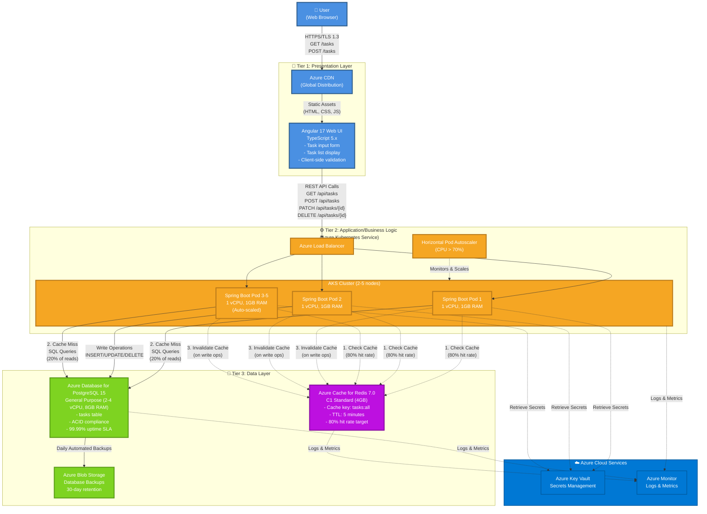

# 4. Architecture Layers

<!-- ARCHITECTURE_TYPE: 3-TIER -->

**Purpose**: Define the three-tier architecture model that separates presentation, business logic, and data concerns.

This architecture follows the **3-Tier Architecture** pattern, designed for standard web applications, REST APIs, and line-of-business systems.

---

## Tiers Overview

| Tier | Function |
|------|----------|
| **Tier 1: Presentation** | User interface layer handling all user interactions, including web pages, API consumption, and client-side logic. |
| **Tier 2: Application/Business Logic** | Core business logic, REST API services, orchestration, business rules, and cache management. |
| **Tier 3: Data** | Data persistence, database management, data access layer, and data integrity enforcement. |

---

## High-Level System Architecture Diagram

This diagram shows the complete 3-tier architecture with all major components and data flows.



**Diagram Description:**

This high-level architecture diagram illustrates the complete 3-tier system with data flows:

- **Tier 1 (Presentation)**: Users interact with Angular 17 web UI served via Azure CDN for global distribution
- **Tier 2 (Application/Business Logic)**: Azure Load Balancer distributes requests across 2-5 Spring Boot pods in AKS cluster. Horizontal Pod Autoscaler monitors CPU usage and scales pods when CPU > 70%
- **Tier 3 (Data)**: Redis cache provides 80% cache hit rate for read operations. PostgreSQL database handles all write operations and cache misses (20% of reads). Daily backups stored in Azure Blob Storage

**Data Flow Patterns:**

1. **Read Flow (Cache Hit - 80%)**: Angular → Load Balancer → Spring Boot Pod → Redis Cache → Response
2. **Read Flow (Cache Miss - 20%)**: Angular → Load Balancer → Spring Boot Pod → PostgreSQL → Populate Cache → Response
3. **Write Flow**: Angular → Load Balancer → Spring Boot Pod → PostgreSQL → Invalidate Cache → Response

**Performance Targets** (see [Key Metrics](01-system-overview.md#key-metrics)):
- Read operations: <1000ms (p95)
- Write operations: <500ms (p95)
- Throughput: 20 TPS read, 10 TPS write
- System Availability: 99.9% uptime

---

### Tier 1: Presentation Layer

**Purpose**: Provide a responsive web interface for task management, enabling users to add, view, complete, and delete tasks through an intuitive UI.

**Components**:
- **Web UI**: Angular 17 single-page application (SPA)
- **Client-Side Logic**: TypeScript business logic, form validation, state management
- **HTTP Client**: Angular HttpClient for REST API communication

**Technologies**:
- **Primary**: Angular 17, TypeScript 5.x
- **Supporting**: RxJS (reactive programming), Angular Material (UI components), Angular Forms (validation)

**Key Responsibilities**:
- Render task list with real-time updates
- Client-side input validation (non-empty text, max length 500 characters)
- User input sanitization to prevent XSS attacks
- Manage UI state (loading indicators, error messages)
- Communicate with Application tier via RESTful APIs

**Communication Patterns**:
- **Inbound**: User interactions (clicks, form submissions) from web browsers
- **Outbound**: HTTPS REST API calls to Spring Boot Application tier
- **Protocols**: HTTPS (TLS 1.3), JSON payload format

**Non-Functional Requirements**:
- **Performance**: <2s initial page load, <100ms UI interaction response
- **Availability**: Stateless client, no availability requirements (depends on Application tier)
- **Scalability**: Served via Azure CDN, scales with CDN capacity

---

### Tier 2: Application/Business Logic Layer

**Purpose**: Execute core business logic for task CRUD operations, manage cache for performance, and provide RESTful APIs for Presentation tier.

**Components**:
- **Task REST API**: Spring Boot REST controllers for task operations
- **Task Service**: Business logic for add, display, complete, delete operations
- **Cache Manager**: Redis integration for task list caching (80% cache hit rate target)
- **Validation Service**: Server-side input validation and sanitization

**Technologies**:
- **Primary**: Java 17 (LTS), Spring Boot 3.2
- **Supporting**: Spring Data JPA, Spring Cache (Redis), Hibernate, HikariCP (connection pooling)

**Key Responsibilities**:
- Expose REST API endpoints: GET /tasks, POST /tasks, PATCH /tasks/{id}, DELETE /tasks/{id}
- Execute business logic: validate input, enforce business rules (max length, sanitization)
- Manage Redis cache: cache GET /tasks responses, invalidate cache on POST/PATCH/DELETE
- Transaction management: ACID-compliant database operations via Spring @Transactional
- Error handling: return appropriate HTTP status codes (400, 404, 500) with error details

**Communication Patterns**:
- **Inbound**: HTTPS REST requests from Angular Presentation tier
- **Outbound**: Database queries to PostgreSQL via JPA, Redis cache operations
- **Protocols**: HTTPS (REST), JDBC (PostgreSQL), Redis protocol

**Non-Functional Requirements**:
- **Performance**: <500ms for POST (p95), <1000ms for GET (p95), <300ms for PATCH/DELETE (p95)
- **Throughput**: Support 20 TPS read, 10 TPS write
- **Availability**: 99.9% uptime, run 2+ instances for redundancy
- **Scalability**: Stateless design, horizontal scaling via Kubernetes (target 5 pods under peak load)

---

### Tier 3: Data Layer

**Purpose**: Persist task data with ACID guarantees, ensuring zero data loss and supporting query performance requirements.

**Components**:
- **Database Management System**: PostgreSQL 15 (Azure Database for PostgreSQL)
- **Data Access Layer**: Spring Data JPA repositories with Hibernate ORM
- **Cache Layer**: Azure Cache for Redis (4GB capacity)
- **Connection Pooling**: HikariCP with 20 connections per Application tier instance

**Technologies**:
- **Primary**: PostgreSQL 15 (managed service), Azure Cache for Redis 7.0
- **Supporting**: Hibernate ORM, HikariCP, pg_stat_statements (query monitoring)

**Key Responsibilities**:
- Persist tasks table with columns: id (UUID), description (VARCHAR 500), status (ENUM), created_at, updated_at
- Enforce data integrity via primary keys, NOT NULL constraints
- Execute queries: SELECT all tasks, INSERT task, UPDATE task status, DELETE task
- Automated daily backups to Azure Blob Storage (30-day retention)
- Query performance optimization via indexes on id (PK) and status

**Schema**:
```sql
CREATE TABLE tasks (
    id UUID PRIMARY KEY DEFAULT gen_random_uuid(),
    description VARCHAR(500) NOT NULL,
    status VARCHAR(20) NOT NULL DEFAULT 'incomplete' CHECK (status IN ('incomplete', 'complete')),
    created_at TIMESTAMP NOT NULL DEFAULT CURRENT_TIMESTAMP,
    updated_at TIMESTAMP NOT NULL DEFAULT CURRENT_TIMESTAMP
);

CREATE INDEX idx_tasks_status ON tasks(status);
```

**Communication Patterns**:
- **Inbound**: SQL queries from Application tier via JDBC/JPA
- **Outbound**: Backups to Azure Blob Storage, replication to read replicas (future)
- **Protocols**: PostgreSQL wire protocol (TLS-encrypted), Azure Blob Storage HTTPS

**Non-Functional Requirements**:
- **Performance**: <50ms query response time (p95), support 30 TPS (20 read + 10 write)
- **Availability**: 99.99% uptime (Azure managed service SLA), automated failover
- **Scalability**: Read replicas for horizontal read scaling (future enhancement)
- **Backup**: Daily automated backups, 30-day retention, <1 hour RPO, <2 hour RTO

---

## Data Flow

**Typical Request Flow: Add Task (Write Operation)**

```
1. User enters task description in Angular web UI and clicks "Add"
   ↓
2. Presentation Tier (Angular)
   - Validates input client-side (non-empty, max 500 chars)
   - Sends POST /api/tasks with JSON: {"description": "Buy groceries"}
   ↓
3. Application Tier (Spring Boot)
   - REST controller receives request
   - Validates input server-side (sanitize for XSS, check constraints)
   - Calls TaskService.createTask()
   - TaskService calls TaskRepository.save()
   ↓
4. Data Tier (PostgreSQL)
   - Hibernate executes INSERT INTO tasks (description, status, created_at, updated_at)
   - Database commits transaction, returns generated UUID
   ↓
5. Application Tier (Spring Boot)
   - Cache invalidation: Redis DELETE /tasks cache entry
   - Returns 201 Created with JSON: {"id": "uuid", "description": "Buy groceries", "status": "incomplete"}
   ↓
6. Presentation Tier (Angular)
   - Receives response, updates local state
   - Renders new task in task list without page reload
```

**Typical Request Flow: Display Tasks (Read Operation - Cache Hit)**

```
1. User navigates to application or refreshes page
   ↓
2. Presentation Tier (Angular)
   - Sends GET /api/tasks
   ↓
3. Application Tier (Spring Boot)
   - REST controller receives request
   - Checks Redis cache for key "tasks:all"
   - Cache HIT (80% of requests) → returns cached JSON array
   ↓
4. Presentation Tier (Angular)
   - Receives JSON array: [{"id": "uuid1", ...}, {"id": "uuid2", ...}]
   - Renders task list
```

**Typical Request Flow: Display Tasks (Read Operation - Cache Miss)**

```
1. User navigates to application or refreshes page
   ↓
2. Presentation Tier (Angular)
   - Sends GET /api/tasks
   ↓
3. Application Tier (Spring Boot)
   - REST controller receives request
   - Checks Redis cache for key "tasks:all"
   - Cache MISS (20% of requests)
   ↓
4. Data Tier (PostgreSQL)
   - Hibernate executes SELECT * FROM tasks ORDER BY created_at DESC
   - Database returns result set
   ↓
5. Application Tier (Spring Boot)
   - Populates Redis cache with key "tasks:all", TTL = 5 minutes
   - Returns JSON array to client
   ↓
6. Presentation Tier (Angular)
   - Receives JSON array, renders task list
```
