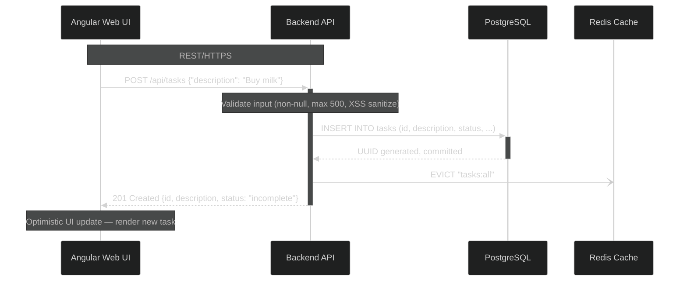
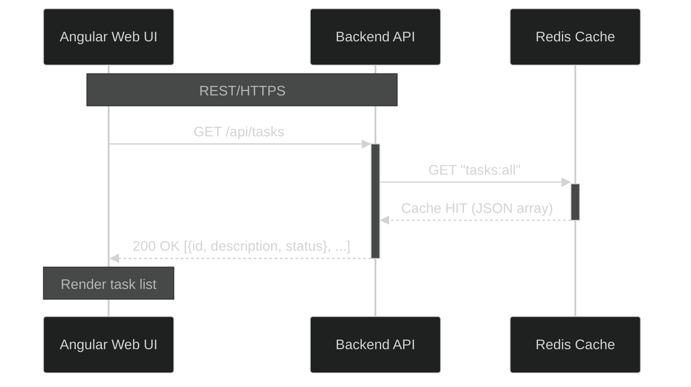
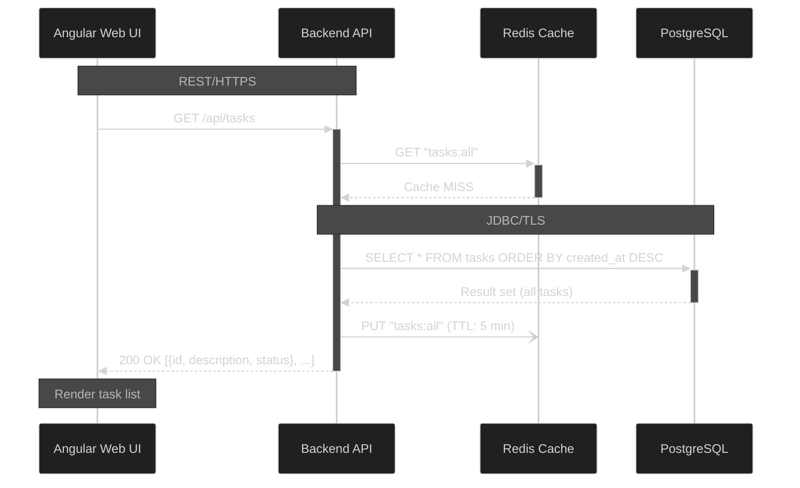
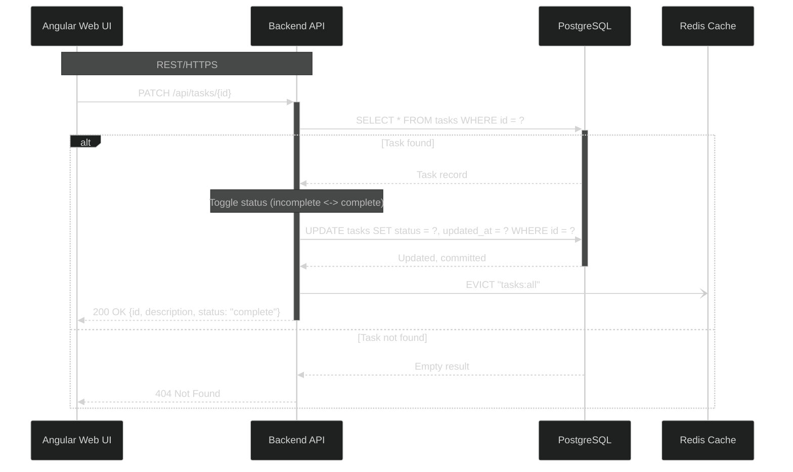
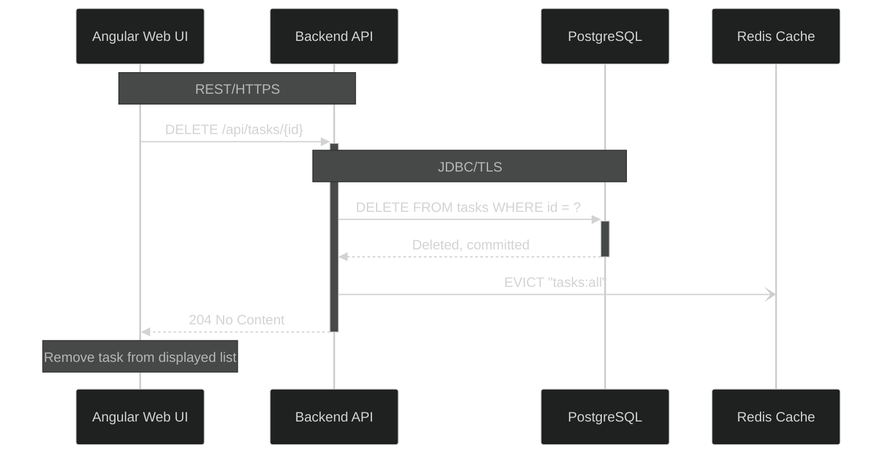

[Architecture](../ARCHITECTURE.md) > Data Flow Patterns

# 6. Data Flow Patterns

This section describes how data flows through the system for each core use case.

### Data Flow 1: Create Task (Write Operation)

**Flow Description**: User creates a new task, which is persisted to the database and cache is invalidated.

```
User (Angular) → POST /api/tasks {"description": "Buy milk"}
  ↓
TaskController (Spring Boot)
  - Validates JSON payload (non-null description, max 500 chars)
  - Calls TaskService.createTask("Buy milk")
  ↓
TaskService (Spring Boot)
  - Sanitizes input (HTML entity encoding)
  - Creates Task entity (status = "incomplete", timestamps = now)
  - Calls TaskRepository.save(task)
  ↓
TaskRepository (Spring Data JPA)
  - Executes Hibernate: INSERT INTO tasks (id, description, status, created_at, updated_at) VALUES (...)
  - Commits transaction
  ↓
PostgreSQL Database
  - Persists record, returns generated UUID
  ↓
TaskService (Spring Boot)
  - Cache invalidation: cacheManager.evict("tasks:all")
  - Returns Task entity
  ↓
TaskController (Spring Boot)
  - Maps Task entity to TaskDTO
  - Returns 201 Created with JSON response: {"id": "uuid", "description": "Buy milk", "status": "incomplete"}
  ↓
Angular UI
  - Updates local task list state (optimistic update)
  - Renders new task in list
```

**Performance**: Target <500ms (p95) end-to-end (see [Key Metrics](01-system-overview.md#key-metrics))

#### Diagram: Create Task Sequence



---

### Data Flow 2: Retrieve Tasks (Read Operation - Cache Hit)

**Flow Description**: User loads the task list, cache hit returns data without database query (80% of requests).

```
User (Angular) → GET /api/tasks
  ↓
TaskController (Spring Boot)
  - Calls TaskService.getAllTasks()
  ↓
TaskService (Spring Boot)
  - Check cache: cacheManager.get("tasks:all")
  - Cache HIT → returns cached List<Task>
  ↓
TaskController (Spring Boot)
  - Maps List<Task> to List<TaskDTO>
  - Returns 200 OK with JSON array: [{"id": "uuid1", ...}, {"id": "uuid2", ...}]
  ↓
Angular UI
  - Renders task list
```

**Performance**: Target <200ms (p95) with cache hit

#### Diagram: Retrieve Tasks (Cache Hit) Sequence



---

### Data Flow 3: Retrieve Tasks (Read Operation - Cache Miss)

**Flow Description**: User loads the task list, cache miss triggers database query (20% of requests).

```
User (Angular) → GET /api/tasks
  ↓
TaskController (Spring Boot)
  - Calls TaskService.getAllTasks()
  ↓
TaskService (Spring Boot)
  - Check cache: cacheManager.get("tasks:all")
  - Cache MISS → calls TaskRepository.findAll()
  ↓
TaskRepository (Spring Data JPA)
  - Executes Hibernate: SELECT * FROM tasks ORDER BY created_at DESC
  ↓
PostgreSQL Database
  - Returns result set (all task rows)
  ↓
TaskService (Spring Boot)
  - Populate cache: cacheManager.put("tasks:all", tasks) with 5-minute TTL
  - Returns List<Task>
  ↓
TaskController (Spring Boot)
  - Maps List<Task> to List<TaskDTO>
  - Returns 200 OK with JSON array
  ↓
Angular UI
  - Renders task list
```

**Performance**: Target <1000ms (p95) with cache miss

#### Diagram: Retrieve Tasks (Cache Miss) Sequence



---

### Data Flow 4: Update Task Status (Write Operation)

**Flow Description**: User toggles task status (incomplete ↔ complete), database updated, cache invalidated.

```
User (Angular) → PATCH /api/tasks/{id}
  ↓
TaskController (Spring Boot)
  - Validates UUID path parameter
  - Calls TaskService.toggleTaskStatus(id)
  ↓
TaskService (Spring Boot)
  - Calls TaskRepository.findById(id)
  - If not found, throws TaskNotFoundException
  - Toggles status: status = (status == "incomplete") ? "complete" : "incomplete"
  - Updates updated_at timestamp
  - Calls TaskRepository.save(task)
  ↓
TaskRepository (Spring Data JPA)
  - Executes Hibernate: UPDATE tasks SET status = ?, updated_at = ? WHERE id = ?
  - Commits transaction
  ↓
PostgreSQL Database
  - Updates record
  ↓
TaskService (Spring Boot)
  - Cache invalidation: cacheManager.evict("tasks:all")
  - Returns updated Task entity
  ↓
TaskController (Spring Boot)
  - Returns 200 OK with updated TaskDTO
  ↓
Angular UI
  - Updates task display (strikethrough, checkmark icon)
```

**Performance**: Target <300ms (p95)

#### Diagram: Update Task Status Sequence



---

### Data Flow 5: Delete Task (Write Operation)

**Flow Description**: User deletes a task, record removed from database, cache invalidated.

```
User (Angular) → DELETE /api/tasks/{id}
  ↓
TaskController (Spring Boot)
  - Validates UUID path parameter
  - Calls TaskService.deleteTask(id)
  ↓
TaskService (Spring Boot)
  - Calls TaskRepository.deleteById(id)
  ↓
TaskRepository (Spring Data JPA)
  - Executes Hibernate: DELETE FROM tasks WHERE id = ?
  - Commits transaction
  ↓
PostgreSQL Database
  - Deletes record (hard delete, no soft delete)
  ↓
TaskService (Spring Boot)
  - Cache invalidation: cacheManager.evict("tasks:all")
  - Returns void
  ↓
TaskController (Spring Boot)
  - Returns 204 No Content
  ↓
Angular UI
  - Removes task from displayed list
```

**Performance**: Target <300ms (p95)

#### Diagram: Delete Task Sequence


